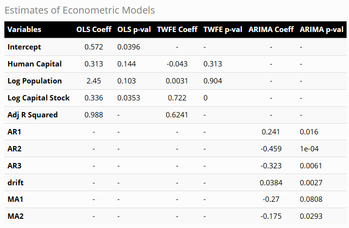
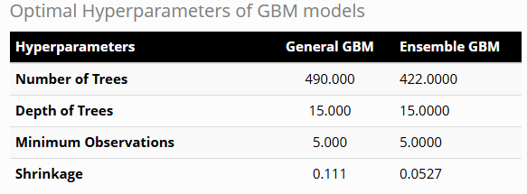
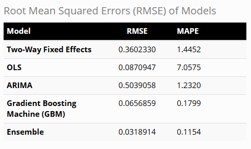
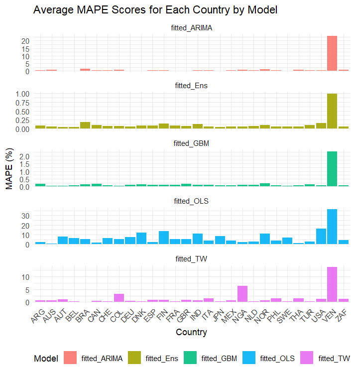
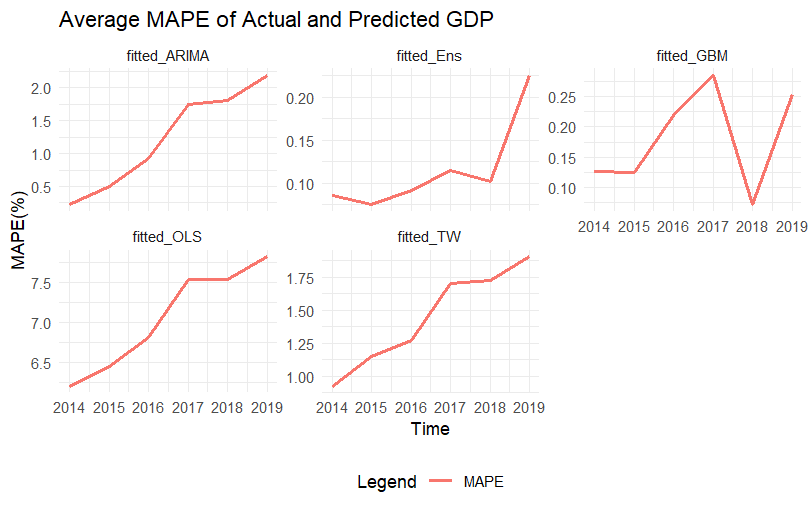
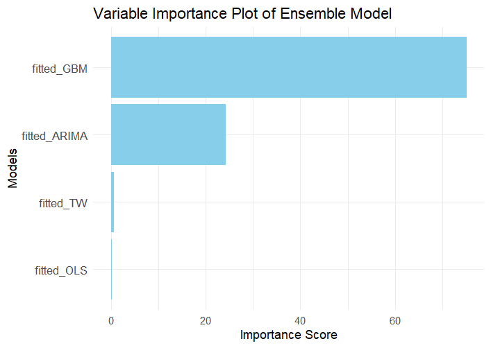

---
output:
  pdf_document:
    latex_engine: xelatex
    number_sections: true
bibliography: Tex/ref.bib
csl: Tex/harvard-stellenbosch-university.csl
header-includes:
  - \usepackage{graphicx}
  - \usepackage{geometry}
  - \geometry{margin=2cm}
  - \usepackage{setspace}
  - \setstretch{1.15}
  - \usepackage{float}
  - \usepackage{multicol}
  - \setlength{\columnsep}{1cm}
---
  
\pagenumbering{roman}

\begin{titlepage}
  \centering
  \includegraphics[width=0.5\textwidth]{Stellenbosch_University_New_Logo.png} \par
  \vspace{2cm}
  {\scshape\Huge An Investigation Into the Performance Of Econometrically Supplemented Machine Learning Models \par}
  \vspace{2cm}
  {\Large\itshape 22568948 \par}
  \vfill
  {\large March 2025 \par}
\end{titlepage}
 
\clearpage

\tableofcontents

\clearpage

\pagenumbering{arabic}

# Introduction {-}

# Literature Review {-}

Forecasting economic variables is a cornerstone of econometric analysis, as the results of these analyses have a significant impact on policymaking and business strategy. The value from forecasting increases as the forecasts become more accurate and reliable, in turn improving policymaking and private-sector decisionmaking [@diebold1998past]. The landscape of econometrics has evolved considerably to improve the accuracy of predictions, this includes the incorporation of machine learning techniques [@athey2019machine]. This section looks at the literature of more classical econometrics and compares the strengths, limits and applications of this approach to the machine learning techniques frequently used today.

Paul Samuelson, a winner of the Nobel Memorial Prize in Economics, described econometrics in the following way, "Econometrics may be defined as the quantitative analysis of actual economic phenomena based on the concurrent development of theory and observation, related by appropriate methods of inference" [@samuelson1954report]. This accurately represents the 

# Data {-}

This paper will use the Penn World Table (PWT) data, version 10.01, that was published on the 23rd of January 2023. This is a data set released by the University of Groningin on a semi-regular basis to provide data on levels of output, input, income and productivity, covering 183 countries between 1950 and 2019. This allows for a well-respected and standardised * data set with which to perform analysis on different techniques for forecasting economic variables.

Due to the length of the data (70 years) and the width of the data (183 countries), there are several extensive gaps in available information across the 52 variables in the data. To minimise the missing values in the data set the following subset is used. Of the countries with no missing GDP data throughout the time frame, the top 30 is selected based on GDP. Pakistan and the Democratic Republic of the Congo is removed from the sample due to missing values in other key variables. This leaves us with 28 remaining countries for the study.

```{r, results='asis', echo=FALSE}
cat("
\\begin{multicols}{4}
\\begin{itemize}
  \\item Argentina
  \\item Australia
  \\item Austria
  \\item Belgium
  \\item Brazil
  \\item Canada
  \\item Switzerland
\\end{itemize}

\\begin{itemize}
  \\item Colombia
  \\item Germany
  \\item Denmark
  \\item Spain
  \\item Finland
  \\item France
  \\item Great Britain
\\end{itemize}

\\begin{itemize}
  \\item India
  \\item Italy
  \\item Japan
  \\item Mexico
  \\item Nigeria
  \\item Netherlands
  \\item Norway
\\end{itemize}

\\begin{itemize}
  \\item Phillipines
  \\item Sweden
  \\item Thailand
  \\item Turkey
  \\item USA
  \\item Venezuela
  \\item South Africa
\\end{itemize}
\\end{multicols}
")
```

The key variables that were selected are the following from the PWT data set. GDP was taken as calculated output side Gross Domestic Product at chained Purchasing Price Parity (PPP) in millions of US dollars. Population is measured in millions, and a human capital index based on the countries average years of schooling and the returns to the said year of schooling. Finally, capital stock is taken at current PPP in millions of US dollars. GDP, population and capital stock is logged so as to reduce skewness and reduce the effect of outliers.

The final transformation is to split the data into a training and testing set so as to adequately train the model on available data and then test the trained model on independent data. The training set is taken as all data from 1950 until 2013, while all data from 2014 until 2019 makes up the test set for the models.

# Methodology {-}

The ensemble model that will be used in this paper will consist of * four different models:

\begin{itemize}
  \item Ordinary Least Squares (OLS) models.
  \item Two Way Fixed Effects (TWFE) model.
  \item Autoregressive Integrated Moving Average (ARIMA) models.
  \item Boosted Tree Model (GBM).
\end{itemize}
 
## OLS Models {-}

The first model that we will discuss is an individual level OLS model for each country. An identical model is fit to the 63 rows for each country in the training data set, this model has the following structure: 

$$
GDP = \beta_0 + \beta_1 \text{HumanCapital} + \beta_2 \text{CapitalStock} + \beta_3 \text{Population} + \epsilon
$$
This is a simple individual level analysis of the GDP of each country, it is a form that is historically popular with economists to display interpretable results on economic relationships. However, it can also be used for forecasting. This model will be tested on the test data set to gauge performance, but model predictions will also be collected for each training GDP value. This allows us to use the predictions of the OLS model in the ensemble model.

## Two Way Fixed Effects Model {-}

This model follows a panel data approach by including all countries into a singular model and then including variables for each specific country and year to control for differences across countries and time periods in the data. Compared to the OLS model, this approach drastically increases the data available to the model to optimise around. However, the assumption of linear relationships remain from the OLS model with the added assumption that the impacts of key variables are consistent across countries. The model is built on the following formula.

$$
GDP_{it} = \beta_0 + \beta_1 \text{HumanCapital}_{it} + \beta_2 \text{CapitalStock}_{it} + \beta_3 \text{Population}_{it} + \gamma_i + \delta_t + \epsilon_{it}
$$

Where:
\begin{itemize}
  \item \( \gamma_i \) captures the individual (country-specific) fixed effects,
  \item \( \delta_t \) captures the year fixed effects.
\end{itemize}

This model is then also tested on the test data and predictions are calculated for the training set to use in the ensemble model.

## ARIMA Models {-}

The country specific ARIMA models were specified using the forecast package in R. This package allows us to have different ARIMA specifications based on the specific series of each country. This allows each country to have the optimal level of differencing, auto-regressive terms and moving average terms. This optimal specification is chosen based on the minimum corrected Akaike Information Criterion (AICc) that adapts the AIC to be a better predictor of fit at smaller sample sizes.

An example of the optimal ARIMA(0,1,1) model for South Africa is shown below:

$$
Y_t = c + Y_{t-1} + \theta_1 \epsilon_{t-1} + \epsilon_t
$$

Where:
\begin{itemize}
  \item c is the drift term (constant trend over time).
  \item \( \theta_1 \) is the moving average (MA) coefficient.
  \item \( \epsilon_t \) is the white noise error term.
\end{itemize}

## Boosted Tree Model {-}

Boosted tree models improve prediction by iteratively explaining remaining variation in the data. A relatively simple decision tree is fitted to the GDP data, then another simple decision tree is modeled on the variation between the prediction of the previous model and the actual values. These models that build on one another can, when optimised fully, accurately map non-linear relationships between variables. This approach to modeling statistical relationships has become increasingly popular in machine learning modeling *. In order to get the optimal boosted tree model that performs well, but does not overfit the data, the following approach is followed.

The data is split into an 80% training set and a 20% test set. Dummy variables are created for each country and each year and used alongside the key variables to predict GDP. The model is trained using 10-fold cross-validation to ensure that the model is not overfitted on the training data. The function used to measure the performance of the decision trees and to optimise the model is the Root Mean Squared Error (RMSE). The following hyperparameters are included in the model:

\begin{itemize}
  \item \textbf{Number of trees}: The number of trees that are used to iteratively model residual variation.
  \item \textbf{Depth of the trees}: The number of splits on variables that can be made by each tree to fit the data.
  \item \textbf{Learning rate}: How much each tree can contribute to the final model. The smaller the learning rate, the smaller the probability of overfitting the data or missing optimal solutions.
   \item \textbf{Minimum Loss Reduction}: The minimum reduction in the RMSE for a split in the decision tree to be included.
    \item \textbf{Minimum data in a leaf}: What is the minimum number of observations that can be split on by a decision tree.
     \item \textbf{Subsampling rate}: The percentage of the training sample that the tree is exposed to. The lower the value, the lower the chance of overfitting the total training sample.
\end{itemize}

In order to optimise the hyperparameters a grid search is performed of hundreds of combinations of these hyperparameters and the combination that best minimises the RMSE is selected as the optimal combination for this model. The ability of this model to conform to underlying patterns in existing data and map on residual variance makes it a popular choice. However, it is by definition without theoretical or interpretable structure as it transforms to the specifics of the data it is exposed to. 

The question then becomes whether the introduction of additional models, more commonly used in economics to map and understand economic relationships, can add to the forecasting power of the boosted tree model. For example, economic theory has found that past GDP growth rates are often good predictors of future GDP growth rates. So would the inclusion of economic theory, through an ARIMA model, improve the forecasting of the boosted tree model? This is tested by building an ensemble model and comparing the performance of this model to the boosted tree model.

## Ensemble Model {-}

The data used to train this model is the predictions from the OLS, TWFE, ARIMA and boosted tree models. A stacked ensemble model is then created by training a linear regression with the following form:

$$
Actual GDP = \beta_0 + \beta_1 \text{OLS Pred} + \beta_2 \text{TWFE Pred} + \beta_3 \text{ARIMA Pred} + \beta_3 \text{Boosted Tree Pred} + \epsilon
$$
This allows for a model that can draw from the strengths of the different models and lessen the impact of the different weaknesses. The models have been added to this model to contribute different aspects.

\begin{itemize}
  \item \textbf{OLS Models}: Captures general trends for each country.
  \item \textbf{TWFE Model}: Captures general trends across all countries, adds time and country specific controls.
  \item \textbf{ARIMA Models}: Models the time series patterns and autocorrelation for each country.
  \item \textbf{Boosted Tree Model}: Captures complex non-linear relationships among predictors.
\end{itemize}

The scale of all of the model predictions are nearly identical, as they all attempt to predict the same GDP series. For this reason the coefficients of the ensemble model can be interpreted as the importance of the specific model in predicting actual GDP values. Thus, a higher coefficient suggests a higher contribution to accurate predictions in the ensemble model.

With the modeling framework and ensemble methodology established, the next step involves evaluating the performance of the models. By analysing the predictions of individual base models and the final ensemble, we can determine their accuracy and reliability in predicting logged GDP across countries and years. Of particular interest is the ability for more classical econometrics to improve more advanced machine learning techniques, we can test this by comparing the forecasting power of the boosted tree model with the ensemble model.

# Results {-}

```{r echo=FALSE, fig.align='center'}

```

Average of all OLS coefficients and p-values across countries.
Very high R-squared for the OLS models on the training data, could be due to to running on levels rather than growth rates
Human capital and log population insignificant at the 10% level for both OLS and TWFE models.
Capital stock significant at the 5% level in the OLS and TWFE model.
Lower R-squared in the TWFE model, different impact of variables on different countries, capital intensive vs human capital intensive economies.

Not all ARIMA variables are used in every model, simply the average of the models where they are used specifically.
Negative values on AR2, AR3, MA1 and MA2. Only MA1 not significant at the 5% significance level.

```{r echo=FALSE, fig.align='center'}

```

Two ensemble models are then optimised using the mlrMBO package, which allows for Bayesian optimisation of hyperparameters. Care is taken in terms of overfitting the data, a significant threat of GBM's. This is done by 10-fold cross-validation and an optimised shrinkage parameter, which controls the additional impact that a tree can have, decreasing bias.

The optimal tree depth for both models is 15 with a minimum observation limit of 5. The optimal shrinkage parameter of the Emsemble model is lower than the general GBM, while also having a lower optimal number of trees.

```{r echo=FALSE, fig.align='center'}

```

The above table includes two measures of the accuracy for the five models that were used on the testing sample from 2014 until 2019. The RMSE that has a heightened sensitivity to individual predictions that are from the actual values. The other measure, MAPE, is a measure of relative performance throughout the sample without preference for larger mistakes.

When comparing the results of the OLS model with the TWFE and ARIMA models we see that the OLS model has a relatively low RMSE and a high MAPE, while the TWFE and ARIMA models have a relatively high RMSE, but a low MAPE.
This suggets that the OLS predicts better throughout the model withour making drastically wrong predictions, whereas the TWFE and ARIMA models performs very well as some points while performing badly at other points.

The general GBM performs better than all the previous models in both the RMSE and the MAPE as it can very accurately represent the data when allowed to be complex enough. Given the context of this analysis the best single model is an optimised GBM. When a GBM is then used to optimise between the predictions of the 4 seperate models we get an optimised ensemble model for predicting GDP. This optimised ensemble GBM performs better than the general GBM, suggesting that the inclusion of the previous models into an ensemble model can improve the prediction from just a base GBM.

```{r echo=FALSE, fig.align='center'}

```

In order the analyse the accuracy of each model across the 28 countries in the data set we plot the above graphs for each of the five models. These graphs show the average MAPE scores across the model testing period from 2014 until 2019 for each country. It is important to note that the scale of the y-axis differs for each graph. This was done to be able to see more detail in the graphs of countries with significantly smaller MAPE scores. When looking at the y-axis we can see that the ensemble model tends to performs the best. 

The bad accuracy of predicting the GDP for Venezuela during the 2014-2019 time frame is due to a country specific structural break that started from the negative impact of low oil prices in 2014, this alongside hyperinflation from the excessive printing of money led to a drastic change in GDP outlook. These external shocks cause weak forecasting accuracy in relation to Venezuela.

The ARIMA model performs rather accurately across all countries, except for Venezuela. The impact of the large difference in predictions in Venezuela explains the high RMSE of the ARIMA model, while maintaining a relatively low MAPE score. 

```{r echo=FALSE, fig.align='center'}

```

This figure shows the accuracy of the forecasting of the different models across the different years of the testing period. It should again be noted that all graphs are on different y-axis scales as it allows us to look more carefully at smaller details in models with lower MAPE scores.

Throughout the models the general trend appears to be weakening accuracy the years move further away from the training sample. This makes sense as the environment and relationships of 2014 data would be closer to the training sample environment than the 2019 data. Thus, as time goes on the relationships between variables might alter and the forecasts weaken.

The one outlier from this is the accurate prediction of the 2018 year by the general GBM model. 

```{r echo=FALSE, fig.align='center'}

```

This figure displays the relative importance scores of the different models in the ensemble GBM model, normalised to be a percentage, this can give us an estimation of the contribution of each model to the ensemble model. There are very small contributions by the OLS (0.0762%) and TWFE (0.5323%) models to the accuracy of the ensemble model. The improvement from the general GBM model to the ensmeble model can be attributed primarily to the inclusion of the ARIMA model into the ensemble model.

The variable importance of the ARIMA model (24.26%) is due to this model predicting data in a structure that is unattainable by the method of the general GBM model (75.13% importance). Specifically, it stems from the ability of the ARIMA model to predict future GDP from GDP values in the near past. Something that the GBM model is not set up to do. This provides insight into the potential for statistical models that are founded in economic theory to improve forecasting accuracy if the economic relationships are uniquely different from the allowed modelling structure of complex machine learning models.

Ek wil nog iets bysit oor die k-density van die actual vs predicted values tussen al die modelle, maar ongelukkig nog nie daarby uitgekom nie.

# Conclusion {-}


# References {-}

